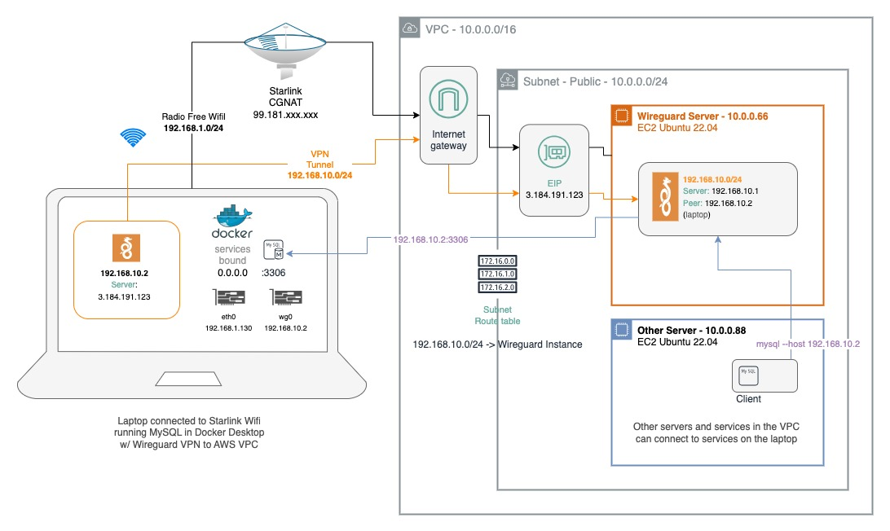

# Wireguard on EC2 behind CGNAT (Starlink)
Quick guide to the key elements of setting up a Wireguard VPN server on AWS EC2 using `Ubuntu 22.04`.  This configuration will allow the following:

- Secure client connection to an AWS VPC Subnet
- AWS VPC servers and services can communicate with services running on the client

> This was developed to allow services (such as AWS DMS) to connect to `docker-compose` stacks running on my laptop, behind Starlink, from my AWS VPC.  Effectively simulating AWS-to-on-premise site-to-site VPN.  

## Wireguard w/ Starlink CGNAT and AWS



## Server Setup

Port `51820 UDP` must be open in the VPC and security groups to the wireguard server.

Also important to note that any ports accessed over the VPN (on the client machine) will need to be allowed in the `wireguard server security group`.

```
sudo apt install wireguard

wg genkey | sudo tee /etc/wireguard/privatekey | wg pubkey | sudo tee /etc/wireguard/publickey

sudo cat /etc/wireguard/privatekey
sudo cat /etc/wireguard/publickey

sudo nano /etc/wireguard/wg0.conf
```

```
[Interface]
Address = 192.168.10.1/24
MTU = 1300
SaveConfig = true
PostUp = iptables -A FORWARD -i %i -j ACCEPT; iptables -A FORWARD -o %i -j ACCEPT; iptables -t nat -A POSTROUTING -o eth0 -j MASQUERADE
PostDown = iptables -D FORWARD -i %i -j ACCEPT; iptables -D FORWARD -o %i -j ACCEPT; iptables -t nat -D POSTROUTING -o eth0 -j MASQUERADE
ListenPort = 51820
PrivateKey = XXXX

[Peer]
PublicKey = XXXXX
AllowedIPs = 192.168.10.2/32
Endpoint = 98.97.123.123:50229
```

The `iptables` commands are key to the tunneling behaviour.

Ensure the interface is `eth0` or adjust above `iptables` commands accordingly.
```
ip -c a
```

Ensure IP Forwarding is enabled.

```
sudo sysctl -w net.ipv4.ip_forward=1
sudo sysctl -p

sudo systemctl enable wg-quick@wg0
sudo systemctl start wg-quick@wg0
```

if you are going to route traffic through the VPN instance instead of masquerade traffic (use network address translation), then you’ll need to disable the source/destination check for the VPN instance. This can be accomplished fairly easily using the AWS CLI:

```
aws ec2 modify-instance-attribute --no-source-dest-check --instance-id i-XXXXXX
```

## Client Setup

Install Wireguard Client, on macOS this is on the AppStore but it is available for every platform.

### Client Tunnel Config

```
[Interface]
PrivateKey = XXXX
Address = 192.168.10.2/32
DNS = 8.8.8.8

[Peer]
PublicKey = XXXXXXXXXXK9la2ebqPoFjcMfgnTUsnMSmUwnDw=
AllowedIPs = 0.0.0.0/0
Endpoint = 3.184.191.123:51820
```

Note that this is the __PublicKey__ of the __Server__ in the __Peer__ section.

__Important__: Make sure to set DNS or you will likely not have internet access when connected to the VPN.

> On the macOS client this can be created in a file and then imported.

Then, back on the `wireguard server` the __Peer__ (client) must be registered:

```
sudo wg set wg0 peer XXXXXXXXccsn/LeNADyyXJeXCWoQAT1y1A= allowed-ips 192.168.10.2
```

Note that the above command uses the __PublicKey__ of the __client__.  

> You should be able to connect and disconnect from the Wireguard VPN on your client (laptop) without interupting SSH sessions.  When connected you will be routing through AWS IGW, and will have a `checkip.amazonaws.com` of your `wireguard server EIP`.  You also won't be able to view reddit as AWS blocks that site outright.  Seems Starlink does less censoring... go Elon.

### Useful Troubleshooting Commands

Find out all the active connections on a server:
```
netstat -anvp tcp | awk 'NR<3 || /LISTEN/'
```

Find out all the listening ports:
```
sudo lsof -PiTCP -sTCP:LISTEN
```

Query the ports available on a remote or local address:
```
sudo nmap -n -PN -sT -sU -p- localhost
```
